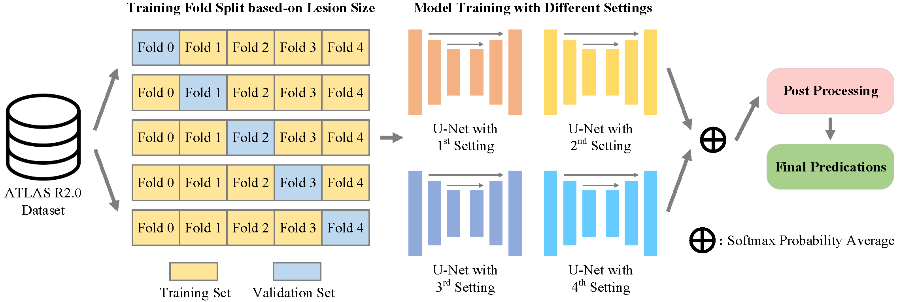

# ATLAS-R2-Docker-Submission (Team CTRL)
The docker submission of team CTRL for ATLAS R2.0 (Anatomical Tracings of Lesions After Stroke Segmentation Challenge). The source code for the algorithm container, generated with evalutils version 0.3.1.

[Paper](https://arxiv.org/abs/2211.15486) | [Weights](#model)



## Model Weights <span id="model"></span>
Download nnUNet model weights from [here](https://emckclac-my.sharepoint.com/:f:/g/personal/k21066681_kcl_ac_uk/EnR3LgIE5D5En1c2vSlzPkgBnzKJJ8Cly_2T56srvbu67A) and put them in `nnUNet_trained_models` folder.

The folder structure should be as follows:
```
ATLAS-R2-Docker-Submission/nnUNet_trained_models/
└── 3d_fullres
    ├── Task100_ATLAS_v2
    │    ├── nnUNetTrainerV2__nnUNetPlansv2.1
    │    │    ├── fold_0
    │    │    │   ├── model_final_checkpoint.model
    │    │    │   └── model_final_checkpoint.model.pkl
    │    │    ├── fold_1
    │    │    ├── fold_2
    │    │    ├── fold_3
    │    │    ├── fold_4
    │    │    └── plans.pkl
    │    ├── nnUNetTrainerV2_800epochs_Loss_DiceTopK10__nnUNetPlansv2
    │    └── nnUNetTrainerV2_ResencUNet_DA3__nnUNetPlans_FabiansResUNet_v2.1
    └── Task103_ATLAS_v2_Self_Training
         └── nnUNetTrainerV2__nnUNetPlansv2.1
```

## Inference
Once you download the model weights, the docker image can be created using `build.sh`. Then it can be further exported as tar.gz file using `export.sh`. The tar.gz file can be directly submitted to Grand-Challenge website for online evaluation. However, if you want to test our model with your own dataset, you have to change the IO part of our codes thus your images can be read and written correctly.

## Training
### 5-fold Local Cross-Validation Results 
Here we provide our 5-fold cross-validation results. The code of calculating some metrics (i.e., Lesionwise F1 Score, Simple Lesion Count, and Volume Difference) can be found at [this link](https://github.com/npnl/atlas2_grand_challenge/blob/main/isles/scoring.py). You can create the 5-fold training set using [fold_index.csv](./fold_index.csv), and compare with our results which are reported as follows:

#### Definition of abbreviations
- `Default`: the model was trained via nnU-Net default settings.
- `DTK10`: the loss function (Dice + CE Loss) was replaced by TopK 10 Loss.
- `ResUNet`: the generic U-Net was replaced by Res U-Net.
- `ST`: we use self-training strategy to retrain the default nnU-Net settings.
- `Ensemble`: predictions of four different training settings were ensembled to get the final results.
- `Ensemble(PP)`: the ensembled results were further handled with our proposed post-processing strategy.

Please note that all values are shown as `average (stand deviation)`. Results show our proposed post-processing strategy can improve the `Jaccard Coefficient`, `Lesionwise F1 Score`, `Simple Lesion Count` and `95% Hausdorff Distance` metrics.

#### **Dice Coefficient** $\uparrow$
| <span style="display:inline-block;width:55px">Dice</span> | Default | DTK10 | ResUNet | ST | Ensemble | Ensemble(PP) |
| :----: | :----: | :----: | :----: | :----: | :----: | :----: |
| Fold 0 | 0.6296 (0.2807) | 0.6267 (0.2885) | 0.6306 (0.2699) | 0.6455 (0.2667) | 0.6418 (0.2743) | 0.6431 (0.2731) |
| Fold 1 | 0.6372 (0.2719) | 0.6341 (0.2725) | 0.6577 (0.2431) | 0.6472 (0.2565) | 0.6542 (0.2579) | 0.6523 (0.2655) |
| Fold 2 | 0.6191 (0.2612) | 0.6143 (0.2699) | 0.6169 (0.2607) | 0.6324 (0.2576) | 0.6313 (0.2611) | 0.6341 (0.2607) |
| Fold 3 | 0.6530 (0.2572) | 0.6463 (0.2550) | 0.6428 (0.2696) | 0.6703 (0.2426) | 0.6611 (0.2540) | 0.6589 (0.2594) |
| Fold 4 | 0.6401 (0.2779) | 0.6307 (0.2858) | 0.6459 (0.2800) | 0.6485 (0.2817) | 0.6470 (0.2817) | 0.6439 (0.2935) |
| Mean   | 0.6358 (0.2693) | 0.6304 (0.2739) | 0.6388 (0.2645) | 0.6488 (0.2608) | 0.6471 (0.2654) | 0.6465 (0.2700) |

#### **Jaccard Coefficient** $\uparrow$
| <span style="display:inline-block;width:55px">JC</span> | Default | DTK10 | ResUNet | ST | Ensemble | Ensemble(PP) |
| :----: | :----: | :----: | :----: | :----: | :----: | :----: |
| Fold 0 | 0.5118 (0.2616) | 0.5109 (0.2656) | 0.5097 (0.2552) | 0.5248 (0.2510) | 0.5231 (0.2562) | 0.5244 (0.2565) |
| Fold 1 | 0.5174 (0.2549) | 0.5141 (0.2553) | 0.5319 (0.2365) | 0.5239 (0.2446) | 0.5323 (0.2458) | 0.5324 (0.2504) |
| Fold 2 | 0.4952 (0.2534) | 0.4927 (0.2596) | 0.4929 (0.2548) | 0.5088 (0.2519) | 0.5085 (0.2536) | 0.5115 (0.2534) |
| Fold 3 | 0.5308 (0.2465) | 0.5226 (0.2446) | 0.5235 (0.2566) | 0.5458 (0.2343) | 0.5393 (0.2450) | 0.5383 (0.2480) |
| Fold 4 | 0.5232 (0.2623) | 0.5155 (0.2687) | 0.5301 (0.2628) | 0.5337 (0.2636) | 0.5323 (0.2653) | 0.5325 (0.2723) |
| Mean   | 0.5157 (0.2553) | 0.5112 (0.2583) | 0.5176 (0.2530) | 0.5274 (0.2488) | 0.5271 (0.2527) | 0.5278 (0.2556) |

#### **Lesionwise F1 Score** $\uparrow$
| <span style="display:inline-block;width:55px">L-F1</span> | Default | DTK10 | ResUNet | ST | Ensemble | Ensemble(PP) |
| :----: | :----: | :----: | :----: | :----: | :----: | :----: |
| Fold 0 | 0.5285 (0.2853) | 0.5242 (0.3028) | 0.5416 (0.2776) | 0.5376 (0.2823) | 0.5463 (0.2916) | 0.5593 (0.2938) |
| Fold 1 | 0.5583 (0.2814) | 0.5586 (0.2823) | 0.5309 (0.2742) | 0.5569 (0.2716) | 0.5832 (0.2827) | 0.5948 (0.3009) |
| Fold 2 | 0.5679 (0.2746) | 0.5635 (0.3048) | 0.5543 (0.2742) | 0.5585 (0.2807) | 0.5870 (0.2816) | 0.5934 (0.2973) |
| Fold 3 | 0.5350 (0.2709) | 0.5373 (0.2721) | 0.5315 (0.2635) | 0.5402 (0.2565) | 0.5536 (0.2695) | 0.5540 (0.2710) |
| Fold 4 | 0.5568 (0.2970) | 0.5509 (0.2963) | 0.5392 (0.2980) | 0.5551 (0.3000) | 0.5722 (0.2981) | 0.5721 (0.3177) |
| Mean   | 0.5493 (0.2815) | 0.5469 (0.2914) | 0.5395 (0.2770) | 0.5497 (0.2779) | 0.5685 (0.2845) | 0.5747 (0.2961) |

#### **Simple Lesion Count** $\downarrow$
| <span style="display:inline-block;width:55px">SLC</span> | Default | DTK10 | ResUNet | ST | Ensemble | Ensemble(PP) |
| :----: | :----: | :----: | :----: | :----: | :----: | :----: |
| Fold 0 | 2.8779 (4.1138) | 3.2748 (4.2968) | 3.0076 (4.1016) | 3.0076 (4.0259) | 3.1298 (4.3099) | 3.0458 (4.1876) |
| Fold 1 | 3.2290 (5.5741) | 3.1221 (5.6596) | 3.2977 (5.3833) | 3.2214 (5.5474) | 3.0153 (5.6961) | 2.9084 (5.5822) |
| Fold 2 | 3.8168 (9.5907) | 3.9084 (9.3187) | 4.1450 (9.4455) | 4.0229 (9.2166) | 3.9313 (9.5982) | 3.9084 (9.6830) |
| Fold 3 | 4.0076 (7.1377) | 3.8244 (7.0400) | 4.0611 (6.9435) | 4.0382 (7.1870) | 3.9237 (7.1668) | 3.9542 (7.1370) |
| Fold 4 | 3.2214 (6.1335) | 3.3740 (6.1197) | 3.2977 (6.0748) | 3.3588 (6.0866) | 3.2061 (6.0938) | 3.0916 (6.1023) |
| Mean   | 3.4305 (6.7530) | 3.5008 (6.6851) | 3.5618 (6.6306) | 3.5298 (6.6359) | 3.4412 (6.7976) | 3.3817 (6.7860) |

#### **Volume Difference** $\downarrow$
| <span style="display:inline-block;width:55px">VD</span> | Default | DTK10 | ResUNet | ST | Ensemble | Ensemble(PP) |
| :----: | :----: | :----: | :----: | :----: | :----: | :----: |
| Fold 0 | 5745 (14129) | 5783 (15054) | 6544 (16136) | 5596 (13805) | 5548 (14120) | 5546 (13858) |
| Fold 1 | 5382 (8580) | 5505 (9477) | 5280 (9147) | 5588 (8957) | 5356 (8983) | 5443 (9282) |
| Fold 2 | 6774 (13283) | 6734 (13401) | 6987 (13729) | 6545 (11441) | 6672 (12788) | 6686 (12859) |
| Fold 3 | 5878 (9995) | 6360 (10505) | 5505 (9166) | 5178 (9376) | 5592 (9617) | 5665 (9662) |
| Fold 4 | 5483 (12194) | 5684 (14459) | 5169 (10455) | 5232 (11279) | 5272 (11589) | 5308 (11609) |
| Mean   | 5852 (11792) | 6013 (12740) | 5897 (12034) | 5628 (11084) | 5688 (11555) | 5729 (11565) |

#### **95% Hausdorff Distance** $\downarrow$
| <span style="display:inline-block;width:55px">95HD</span> | Default | DTK10 | ResUNet | ST | Ensemble | Ensemble(PP) |
| :----: | :----: | :----: | :----: | :----: | :----: | :----: |
| Fold 0 | 21.9424 (26.5471) | 22.9445 (29.4410) | 24.4844 (29.6224) | 23.1442 (28.2716) | 21.9932 (28.0031) | 21.8031 (27.8958) |
| Fold 1 | 23.3701 (29.4259) | 22.7847 (29.5189) | 22.5037 (26.9299) | 25.9064 (31.4047) | 19.7646 (26.9798) | 18.6559 (25.8924) |
| Fold 2 | 25.1042 (28.9482) | 22.7503 (26.6958) | 24.7657 (29.2783) | 25.2911 (28.2942) | 23.7604 (27.3718) | 23.6472 (28.2301) |
| Fold 3 | 23.7723 (26.2052) | 23.0876 (27.7285) | 25.0762 (28.5598) | 24.5008 (28.5301) | 21.6835 (25.1667) | 21.8672 (24.9015) |
| Fold 4 | 22.2612 (27.0096) | 20.2716 (24.1904) | 22.7937 (28.0585) | 24.9583 (32.0520) | 21.2032 (25.6630) | 21.5658 (27.2707) |
| Mean   | 23.2967 (27.5984) | 22.3603 (27.5005) | 23.9217 (28.4317) | 24.7687 (29.6890) | 21.6813 (26.5961) | 21.5105 (26.8280) |

## Code Structure
- `Dockfile`: the necessary file to generate docker image, the predefined entry point can be found at `line 32`.
- `predict.sh`: the bash script for running all prediction steps automatically.
- `copy_images_to_nnunet_format.py`: change raw images to nnunet format.
- `predict_all_folds.sh`: the bash script for running predictions using all models, and ensembling.
- `rename_predictions.py`: apply post-processing to predictions, then change them to nnunet format.
- `requirements.txt`: necessary packages for building the docker image.
- `build.sh`: the bash script for building the docker image.
- `export.sh`: the bash script for exporting the docker image to tar.gz file.
- `fold_index.csv`: the 5-fold split index for each image. You can use it to do the 5-fold cross-validation.

## Citation
If the code is useful for your research, please consider citing our paper:
```bibtex
@article{huo2022mapping,
    title   = {MAPPING: Model Average with Post-processing for Stroke Lesion Segmentation},
    author  = {Huo, Jiayu and Chen, Liyun and Liu, Yang and Boels, Maxence and Granados, Alejandro and Ourselin, Sebastien and Sparks, Rachel},
    journal = {ArXiv},
    year    = {2022},
    volume  = {abs/2211.15486}
}
```

## Acknowledgments
We thank the Applied Computer Vision Lab (ACVL) for developing and maintaining [nnU-Net](https://github.com/MIC-DKFZ/nnUNet), and challenge organization team for releasing [ATLAS R2.0 Dataset](https://atlas.grand-challenge.org/ATLAS/).
